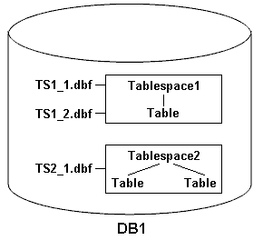

= Exemples d'opérations de sauvegarde, de restauration et de récupération
:allow-uri-read: 
:icons: font
:imagesdir: ../media/

[role="lead"]
Vous pouvez trouver des informations sur certains scénarios de sauvegarde, de restauration et de restauration que vous pouvez utiliser pour atteindre vos objectifs de protection des données.

L'illustration suivante montre le contenu de l'espace de table :

Dans l'illustration, Tablespace1 a une table et deux fichiers de base de données qui lui sont associés. Tablespace2 est associé à deux tables et un fichier de base de données.

Les tableaux suivants décrivent des scénarios de sauvegarde, de restauration et de restauration complets et partiels :

== Exemples d'opérations complètes de sauvegarde, de restauration et de restauration

|===
| Sauvegarde complète | Restaurer | Reprise après incident 

 a| 
SnapManager sauvegarde tout ce qui se trouve dans la base de données DB1, y compris les fichiers de données, les journaux d'archive et les fichiers de contrôle.
 a| 
Restauration complète avec les fichiers de contrôle SnapManager restaure tous les fichiers de données, les espaces de stockage et les fichiers de contrôle dans la sauvegarde.
 a| 
Vous pouvez indiquer l'une des options suivantes :

* SCN - Entrez un SCN, par exemple 384641.
* Date/heure - Entrez une date et une heure de sauvegarde, par exemple 2005-11-25:19:06:22.
* La dernière transaction effectuée dans la base de données.

 a| 
Restauration complète sans fichiers de contrôle SnapManager restaure l'ensemble des espaces de stockage et des fichiers de données sans les fichiers de contrôle.

 a| 
La restauration des fichiers de données ou des espaces de stockage avec des fichiers de contrôle est l'un des éléments suivants :

* Espaces de stockage
* Fichiers de données

 a| 
SnapManager restaure les données à la dernière transaction effectuée dans la base de données.

 a| 
Restauration de fichiers de données ou d'espaces de stockage sans contrôle des fichiers SnapManager restaure l'un des éléments suivants :

* Espaces de stockage
* Fichiers de données

 a| 
Restaurer les fichiers de contrôle uniquement

|===

== Exemples d'opérations partielles de sauvegarde, de restauration et de restauration

|===
| Sauvegarde partielle | Restaurer | Reprise après incident 

 a| 
Vous pouvez choisir l'une des options suivantes :

* Espaces de stockage
+
Vous pouvez spécifier Tablespace1 et Tablespace2 ou seulement un d'entre eux.

* Fichiers de données
+
Vous pouvez spécifier les trois fichiers de base de données (TS1_1.dbf, TS1_2.dbf et TS2_1.dbf), deux fichiers ou un fichier.

Quelle que soit l'option sélectionnée, la sauvegarde inclut tous les fichiers de contrôle. Les fichiers journaux d'archive sont inclus dans la sauvegarde partielle si le profil n'est pas activé pour créer séparément les sauvegardes du journal d'archivage.
 a| 
La restauration complète SnapManager restaure tous les fichiers de données, les espaces de stockage et les fichiers de contrôle spécifiés dans la sauvegarde partielle.
 a| 
SnapManager restaure les données à la dernière transaction effectuée vers l'instance de base de données.

 a| 
Restauration de fichiers de données ou d'espaces de stockage avec des fichiers de contrôle. SnapManager restaure l'un des éléments suivants :

* Tous les fichiers de données spécifiés
* Tous les espaces de stockage spécifiés

 a| 
Restauration de fichiers de données ou d'espaces de stockage sans fichiers de contrôle. SnapManager restaure l'un des éléments suivants :

* Espaces de stockage
+
Spécifiez l'un des espaces de stockage. SnapManager restaure uniquement les espaces de stockage spécifiés. Si la sauvegarde contient Tablese1, SnapManager ne restaure que cet espace de table.

* Fichiers de données
+
Spécifiez l'un des fichiers de base de données. SnapManager restaure uniquement les fichiers de données spécifiés. Si la sauvegarde contient des fichiers de base de données (TS1_1.dbf et TS1_2.dbf), SnapManager restaure uniquement ces fichiers.

 a| 
Restaurer les fichiers de contrôle uniquement

|===